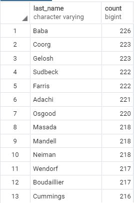
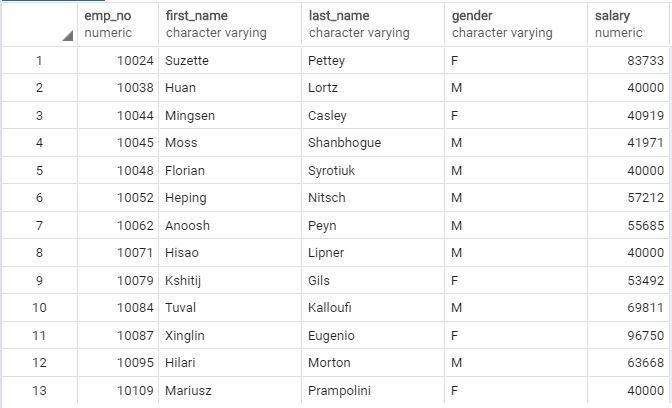
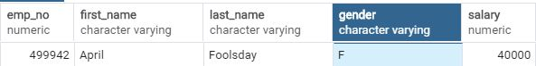

# SQL
### Summary 
This repository shows the appropriate syntax for a research project on employees of Pewlett Hackard from the 1980s and 1990s. 
### Technical Details 
In order to run the code, it is required postgre sql. 
### Screenshots 
LastNamesCount.JPG 
 
EmployeesSalary.JPG 
 
LastNamesCount.JPG 
 
499942.JPG 
 
### Explanations 
The outcome is shown in screenshots for reference purpose of the public. 

# SQL

Research project on employees of Pewlett Hackard from the 1980s and 1990s. 
The database of employees from that period are in six CSV files.
Design the tables to hold data in the CSVs (Data Modeling): Sketch out an ERD of the tables with http://www.quickdatabasediagrams.com
Import the CSVs into a SQL data base (Data Engineering): Create a table schema for each of the six CSV files and specify data types, primary keys, foreign keys, and other constraints. Import each CSV file into the corresponding SQL table.
Answer questions about the data (Data Analysis): 
* List the following details of each employee: employee number, last name, first name, gender, and salary.
* List employees who were hired in 1986.
* List the manager of each department with the following information: department number, department name, the manager's employee number, last name, first name, and start and end employment dates.
* List the department of each employee with the following information: employee number, last name, first name, and department name.
* List all employees whose first name is "Hercules" and last names begin with "B."
* List all employees in the Sales department, including their employee number, last name, first name, and department name.
* List all employees in the Sales and Development departments, including their employee number, last name, first name, and department name.
* In descending order, list the frequency count of employee last names, i.e., how many employees share each last name.

Be sure to make any necessary modifications for your username, password, host, port, and database name in Jupyter Notebook:
from sqlalchemy import create_engine
engine = create_engine('postgresql://localhost:5432/<your_db_name>')
connection = engine.connect()

Consult SQLAlchemy documentation for more information.
See https://www.youtube.com/watch?v=2uaTPmNvH0I and https://martin-thoma.com/configuration-files-in-python/ for more information.
Create a bar chart of average salary by title.
Look down with a sly grin and see that your employee ID number is 499942.
